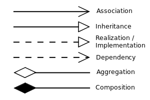

# Object Composition

## Composition vs inheritance

Many ways to do composition : [The Hidden Treasures of Object Composition](https://medium.com/javascript-scene/the-hidden-treasures-of-object-composition-60cd89480381)

[Composition over inheritance, Wikipedia](https://en.wikipedia.org/wiki/Composition_over_inheritance)

[Design Patterns: Elements of Reusable Object-Oriented Software, Wikipedia](https://en.wikipedia.org/wiki/Design_Patterns)

https://en.wikipedia.org/wiki/Composition_over_inheritance#Inheritance_and_interfaces
=> Exemple à transcrire en TypeScript et à améliorer : pas besoin d'héritage!

## Aggregation vs Composition

Simple rules:

- Aggregation : weak   “has a” relationship - A "uses" B = B exists independently (conceptually) from A.
- Composition : strong “has a” relationship - A "owns" B = B has no meaning or purpose in the system without A: B cannot exist outside A and when A is destroyed, so does B.

=> Aggregation is a general form of Composition.

Example 1 - Company :

- A Company is an aggregation of People.
- A Company is a composition of Accounts.
- When a Company ceases to do business its Accounts cease to exist but its People continue to exist.

Example 2 - Text Editor (simplified) :

- A Text Editor owns a Buffer (composition).
- A Text Editor uses a File (aggregation).
- When the Text Editor is closed, the Buffer is destroyed but the File itself is not destroyed.

UML class diagram:

- Aggregation : unfilled diamond and solid line
- Composition : filled diamond and solid line

Beware that in UML, composition has a more narrow meaning than in ordinary language.

## Generalization/Inheritance

The generalization relationship is also known as the _inheritance_ or "is a" relationship.

## [Delegation](https://en.wikipedia.org/wiki/Delegation_%28object-oriented_programming%29)

Refers to evaluating a member (property or method) of one object (the receiver/delegate) in the context of another object (the sender/wrapper).

Delegation can be done:

- Explicitly: by passing the sending object to the receiving object, which can be done in any object-oriented language;
- Implicitly: by the member lookup rules of the language, which requires _language support_ for the feature.

Implicit delegation is the fundamental method for behavior reuse in prototype-based programming (aka instance-based programming), corresponding to inheritance in class-based programming. The best-known languages that support delegation at the language level are Self and JavaScript.

In JavaScript, _delegation_ already happens implicitly when the `prototype` chain is walked in order to find a member that might be related to but is not directly owned by an object. Once the method was found it gets called within this objects context. It happens also more explicitly, using `apply`, `call` and `bind` to provide a value to `this` that is used in the body of the target function.

## [Forwarding](https://en.wikipedia.org/wiki/Forwarding_%28object-oriented_programming%29)

Refers to evaluating a member on one object by evaluating the corresponding member on another object, notably in the context of the receiving object.

## Delegation vs Forwarding

They can confused because they ressemble. In both cases, there are two objects: the sender/wrapper and the receiver/wrappee. The sender calls a member of the receiver, which can be done in a member of the sender with the same signature than the receiver member: same name and same arguments in case of a method. They differ in the context, the `this` in C#, Java, JavaScript/TypeScript:

- In _delegation_ it refers to the sending object, as if the receiver member body was directly inside the sender.
- In _forwarding_ it refers to the receiving object which is anaware of the sender.

_Implicit delegation_ and _forwarding_ ressemble even more. In both cases, the wrapper doesn't pass itself to the wrappee. The wrappee is not aware of the wrapper. The association is unidirectional.

Another source of confusion: the [delegation pattern](https://en.wikipedia.org/wiki/Delegation_pattern) which is more a kind of _forwarding_!

---

## Warning foreword

> Inheritance should be used with care, due to the strong coupling between base and derived classes, breaking the [S**O**LID Open/Closed Principle](https://en.wikipedia.org/wiki/Open/closed_principle). Ask yourself the question: "Is there really a 'is-a' relationship between both classes?". Any kind of [object composition](./object-composition.md) i.e. 'has-a' relationship should be considered first or during a refactoring phase (cf. [Red/Green/Refactor TDD mantra](https://en.wikipedia.org/wiki/Test-driven_development#Development_style)).
>
> Nevertheless, inheritance should not be banned too. Every technique has its advantages and drawbacks and can be appropriate in some situations. For instance, inheritance is used in the [Template Method Pattern](https://en.wikipedia.org/wiki/Template_method_pattern), despite the fact that [Composition over inheritance](https://en.wikipedia.org/wiki/Composition_over_inheritance) is a principle  given and applied in [GoF Design Patterns](https://en.wikipedia.org/wiki/Design_Patterns).

